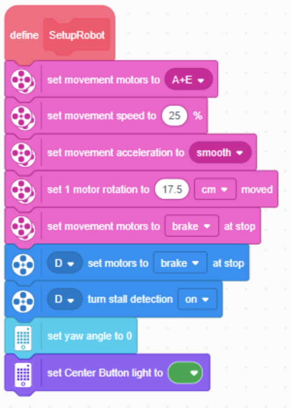
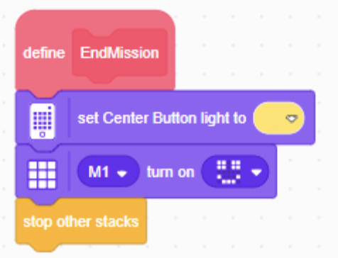
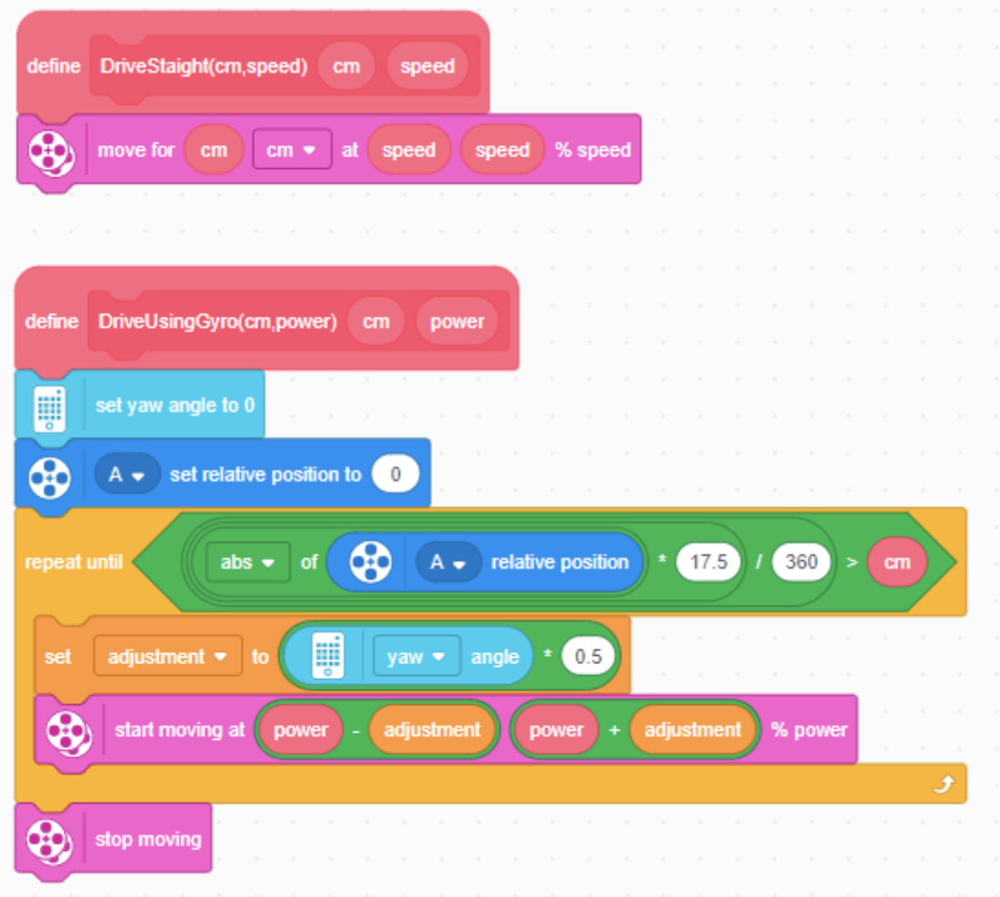
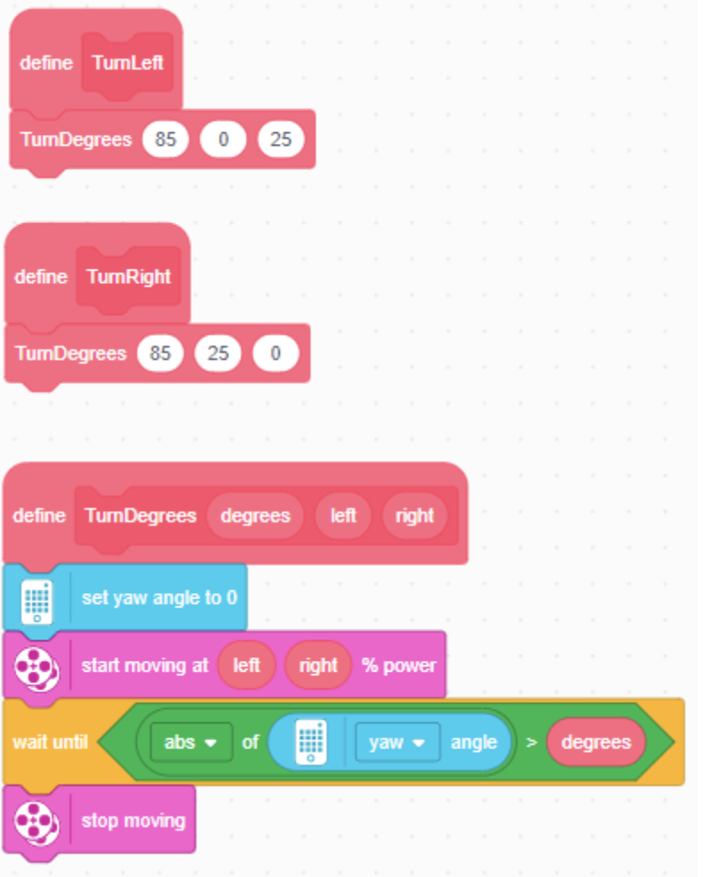
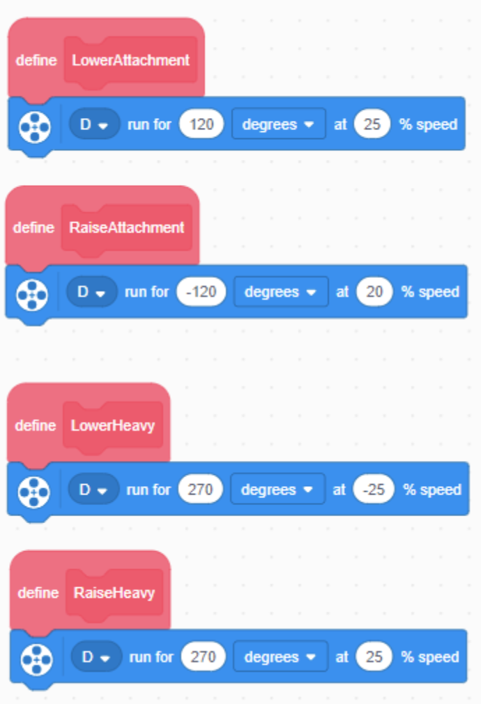
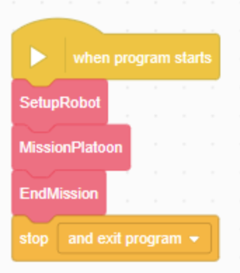
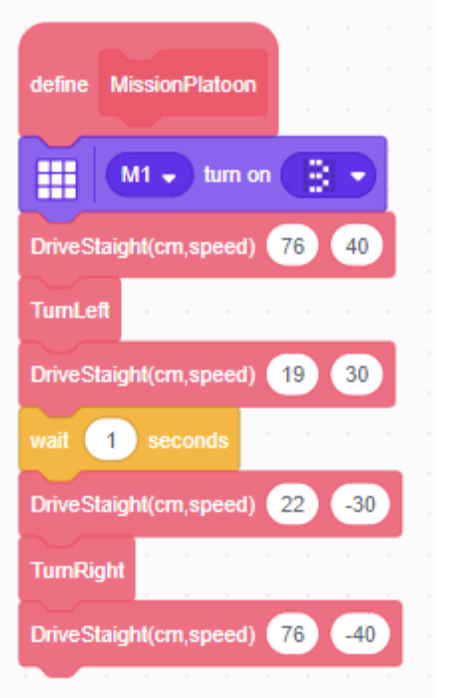

**SetupRobot and EndMission**

SetupRobot should be the first step when program starts.

EndMission should be the last step of the main program.

These ensure the motors and sensors are set up properly.

The center button light indicates the status

Green = Running, Yellow = Mission End 

 
SetupRobot Code:

EndMission Code:

**Driving Straight**

While there are many different built in blocks for driving, maintaining a consistent straight heading can be difficult for long runs because of the differences in motors/wheels and the mat.

Use DriveStraight(cm,speed) to drive a short distance.

Note that cm a positive distance and speed indicates the percentage, which can be negative to drive backward.

DriveUsingGyro attempts to adjust the each wheel power based on the angle. 

**Turning**

The most common turns are right angle left and right turns. Notice those blocks use only 25% power and specify only 85 degrees because the robot continues to move a bit and to handle the slight gyro inaccuracy. When using TurnDegrees, both the left and right wheel power need to be specified.

**Attachment Control**
LowerAttachment and RaiseAttachment provide an easy way to consistently deal with the main front motor (D).

Note that LowerHeavy and RaiseHeavy should be used with the Large Cargo Delivery mission attachment,

so perhaps they should be moved to just that program file since they are not normally used. 

 
**Missions**
The main program for a mission has the standard setup surrounding the one MyBlock 

The Mission steps are kept as simple as possible

Note the first line set the display to indicate which run (3)

